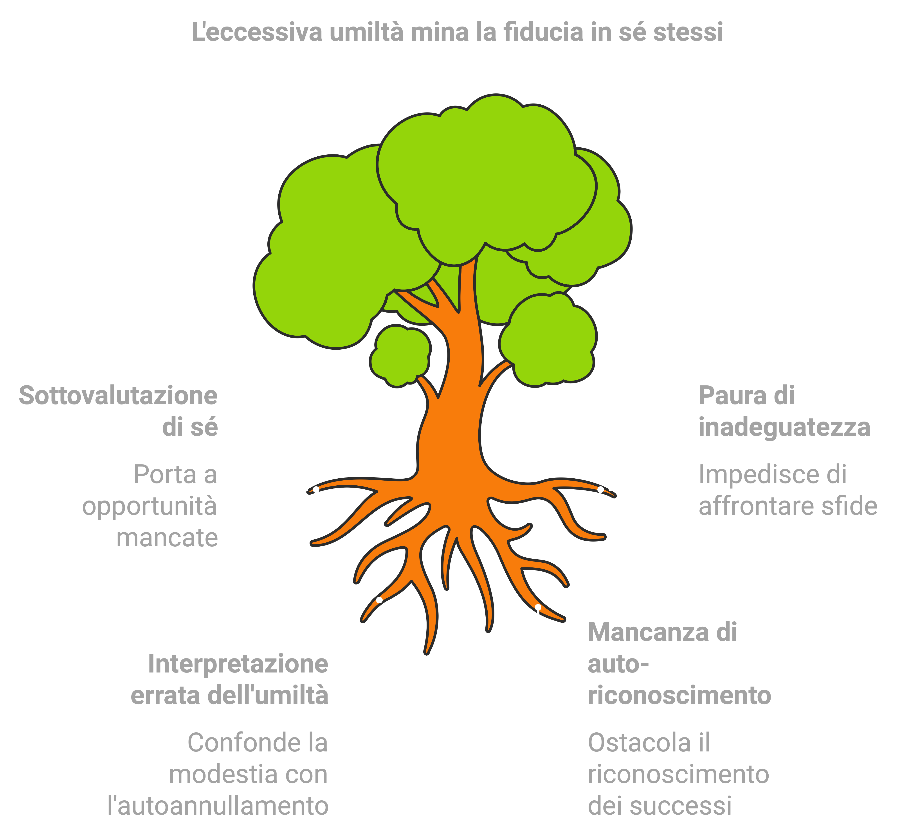
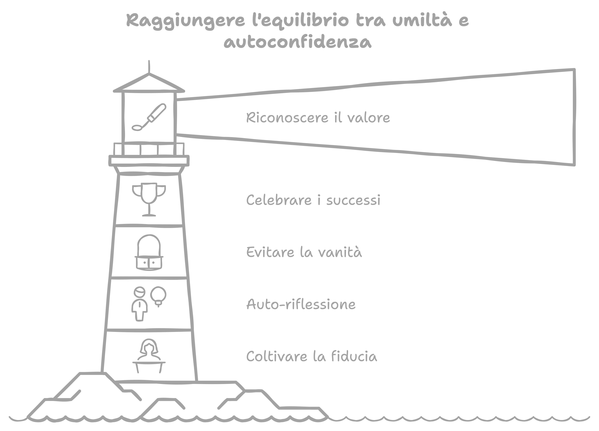

# The importance of humility, but without losing self-confidence

Humility is one of the most appreciated and sought-after qualities, both in personal and professional life. Being humble helps us grow, learn from others and recognize that we do not always have all the answers. It allows us to approach people with respect, creating authentic relationships based on mutual esteem. But it is important to remember that, like all virtues, humility must also be cultivated with balance.

## When humility becomes a limit

However, there is an insidious risk that hides behind excessive humility. While on the one hand it can be a sign of maturity and wisdom, on the other it can turn into a trap that undermines self-confidence. Being excessively humble can lead to underestimating one's abilities, to belittling one's successes or even to avoiding opportunities for fear of not being "enough" to face them.

In a world where comparing ourselves to others is the order of the day, it is easy to fall into the trap of thinking that humility means self-deprecation or extreme modesty. But being humble does not mean belittling yourself, but rather recognizing your limits without losing sight of your strengths. Humility must coexist with a healthy dose of self-esteem.

## Cultivating a balance: Humility and Self-Confidence

The ideal balance consists of recognizing your own value without falling into arrogance. We can be aware of our skills, celebrating successes with gratitude but without turning them into vanity. We must learn to recognize what we have achieved without feeling superior to others, but also without belittling our path.

To achieve this balance, it is useful to ask yourself: "Am I rejecting this recognition because I am truly humble, or because I do not believe in myself enough?" Cultivating self-confidence does not mean becoming arrogant, but having the awareness of your own abilities to confidently face challenges and goals.

## In Conclusion

Humility and self-confidence are not conflicting qualities, but two sides of the same coin. Being humble keeps us grounded in reality, but having self-confidence pushes us to dream bigger and face challenges without fear.

> “Humility does not consist in thinking less of yourself, but in thinking less of yourself.” – *C.S. Lewis*

